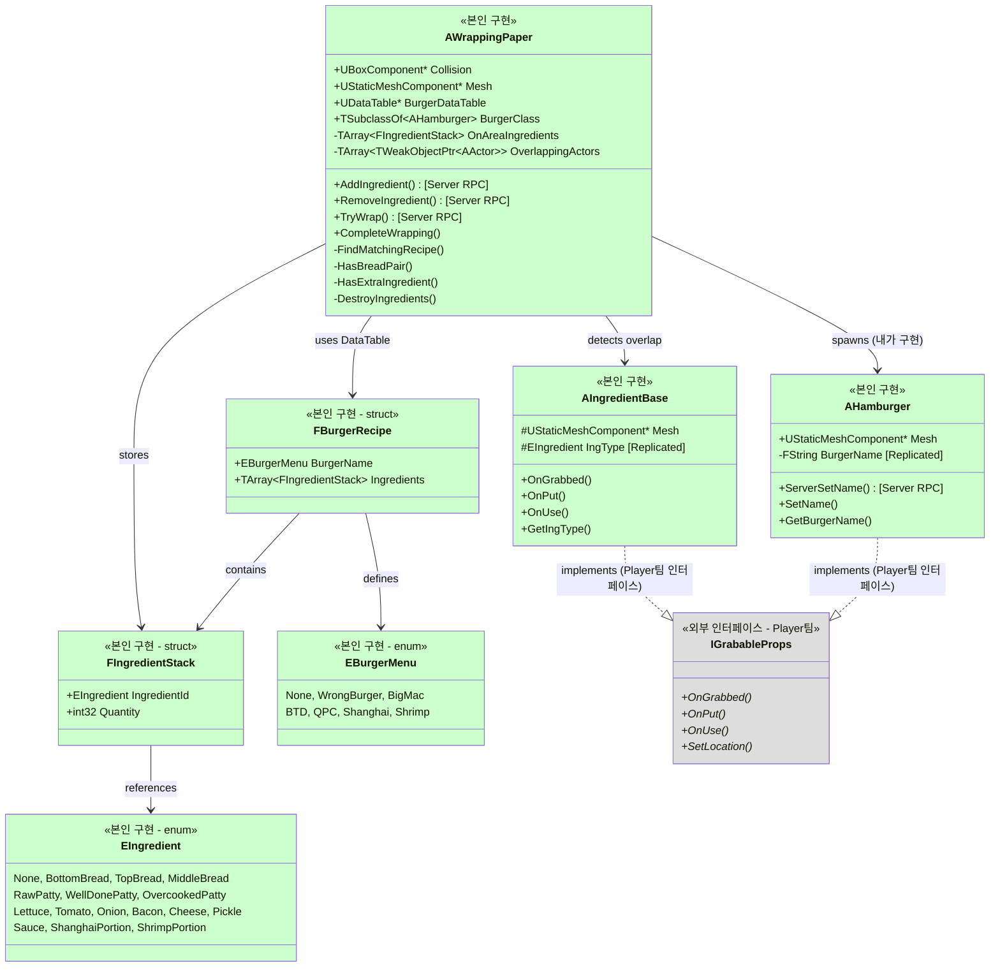
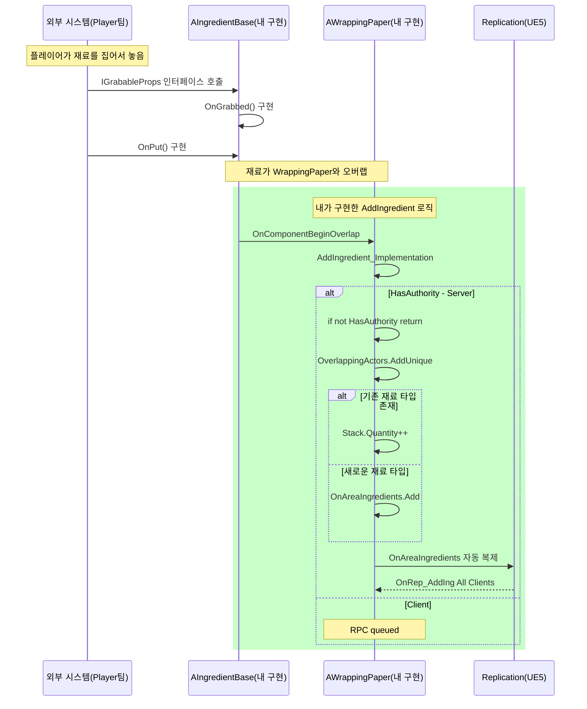
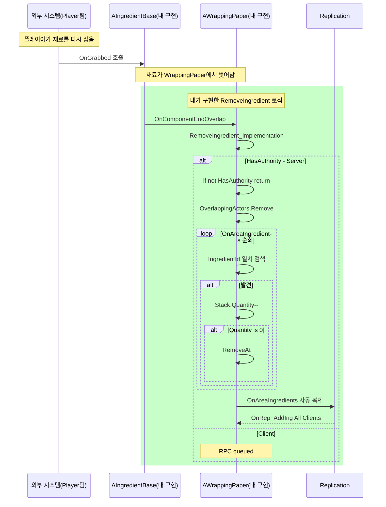
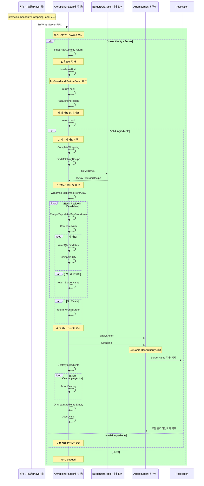
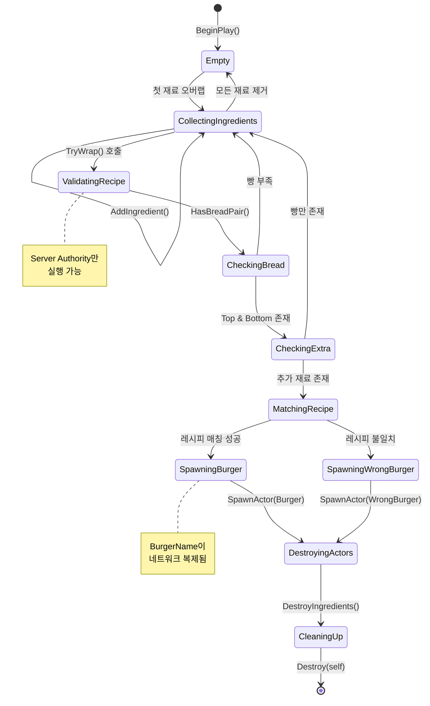
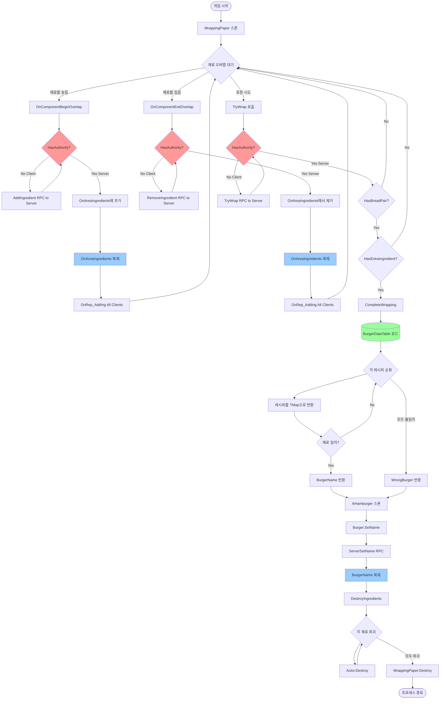
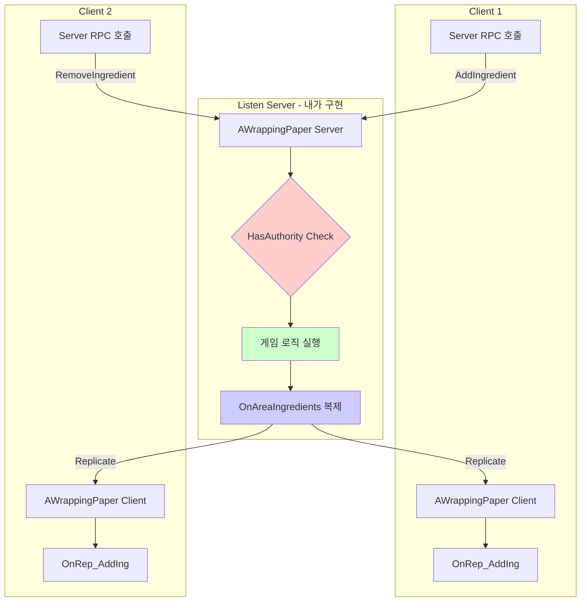
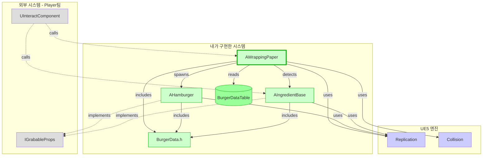

# WrappingPaper 시스템 설계 문서

## 개요

**작성자**: KHB (본인 구현)
**구현 범위**: WrappingPaper, IngredientBase, BurgerData, Hamburger

이 문서는 **내가 직접 구현한 햄버거 조립 시스템**의 설계와 구현을 설명합니다. `AWrappingPaper`는 게임의 핵심 메커니즘으로, 플레이어가 재료를 모아 햄버거를 만드는 전체 프로세스를 담당합니다.

**내가 구현한 핵심 기능**:
- ✅ 재료 오버랩 감지 및 수량 추적 (`AddIngredient`, `RemoveIngredient`)
- ✅ DataTable 기반 레시피 매칭 알고리즘 (`FindMatchingRecipe`)
- ✅ 햄버거 스폰 및 재료 자동 정리 (`CompleteWrapping`, `DestroyIngredients`)
- ✅ 멀티플레이 네트워크 동기화 (Server RPC + Replication)
- ✅ 재료 베이스 클래스 (AIngredientBase + 25종 서브클래스)
- ✅ 햄버거 데이터 정의 (BurgerData.h - Enum 및 구조체)

**외부 의존성** (팀원 구현):
- InteractComponent (Player팀 - 집기/놓기 시스템)
- MHGACharacter (Player팀 - 캐릭터 컨트롤러)
- IGrabableProps (Player팀 - 상호작용 인터페이스)

---

## 클래스 다이어그램 (내 구현 범위)



---

## 시퀀스 다이어그램 - 내가 구현한 WrappingPaper 동작

**참고**: InteractComponent와 MHGACharacter는 **팀원(Player팀)이 구현**한 시스템입니다.
여기서는 **내 코드(WrappingPaper, Ingredient)가 어떻게 외부 시스템과 통신하는지**만 설명합니다.

### 1. 재료 추가 플로우 (내 구현: AddIngredient)



### 2. 재료 제거 플로우 (내 구현: RemoveIngredient)



### 3. 햄버거 포장 플로우 (내 구현: TryWrap, CompleteWrapping, FindMatchingRecipe)



---

## 상태 다이어그램 - WrappingPaper 생명주기



---

## 데이터 플로우 다이어그램



---

## 네트워크 아키텍처 (내 구현)

### Authority 및 RPC 패턴

**내가 구현한 네트워크 패턴**: Server Authority + Replication



### 레플리케이션 설정 (내 구현)

**AWrappingPaper (본인 구현)**:

| 변수/함수 | 타입 | 방향 | 설명 (내 구현 내용) |
|----------|------|------|------|
| `OnAreaIngredients` | Replicated (OnRep) | Server → Clients | 재료 목록 자동 동기화 |
| `AddIngredient()` | Server RPC | Overlap Event → Server | 재료 추가 (UE5 Overlap 이벤트 자동 호출) |
| `RemoveIngredient()` | Server RPC | Overlap Event → Server | 재료 제거 (UE5 Overlap 이벤트 자동 호출) |
| `TryWrap()` | Server RPC | External → Server | 포장 시도 (InteractComponent에서 호출) |
| `bReplicates` | Property | - | 생성자에서 `true` 설정 |

**AIngredientBase (본인 구현)**:

| 변수/함수 | 타입 | 방향 | 설명 (내 구현 내용) |
|----------|------|------|------|
| `IngType` | Replicated | Server → Clients | 재료 타입 (EIngredient) 자동 동기화 |
| `OnGrabbed()` | 인터페이스 구현 | - | IGrabableProps 인터페이스 구현 (Player팀 요구사항) |
| `OnPut()` | 인터페이스 구현 | - | IGrabableProps 인터페이스 구현 |

**AHamburger (본인 구현)**:

| 변수/함수 | 타입 | 방향 | 설명 (내 구현 내용) |
|----------|------|------|------|
| `BurgerName` | Replicated | Server → Clients | 햄버거 이름 (레시피 매칭 결과) 동기화 |
| `ServerSetName()` | Server RPC | - | SetName()에서 Client일 때 자동 호출 |
| `SetName()` | Public Method | - | Authority 체크 후 분기 처리 |

---

## 주요 알고리즘 (내가 구현)

### 1. 레시피 매칭 알고리즘 (FindMatchingRecipe) - 핵심 로직

```cpp
// 의사 코드
function FindMatchingRecipe(DataTable, WrapperIngredients):
    WrapperMap = ConvertToMap(WrapperIngredients)  // O(n)

    AllRecipes = DataTable.GetAllRows()  // O(r), r = 레시피 수

    for each Recipe in AllRecipes:  // O(r)
        RecipeMap = ConvertToMap(Recipe.Ingredients)  // O(m), m = 재료 수

        if RecipeMap.Count != WrapperMap.Count:
            continue

        isMatched = true
        for each (Key, Value) in RecipeMap:  // O(m)
            if WrapperMap[Key] != Value:
                isMatched = false
                break

        if isMatched:
            return Recipe.BurgerName

    return WrongBurger

// 시간 복잡도: O(r * m)
// 공간 복잡도: O(m) - TMap 저장
```

### 2. 재료 수량 관리 (AddIngredient) - 내가 구현한 중복 체크 로직

```cpp
// WrappingPaper.cpp:57-107 실제 구현
void AWrappingPaper::AddIngredient_Implementation(...)
{
    if (!HasAuthority()) return;  // 서버만 실행

    OverlappingActors.AddUnique(OtherActor);  // WeakPtr 저장

    AIngredientBase* OtherIngredient = Cast<AIngredientBase>(OtherActor);

    if (OtherIngredient != nullptr)
    {
        const EIngredient IngId = OtherIngredient->GetIngType();

        // 핵심 로직: 기존 재료 타입 중복 체크
        for (FIngredientStack& tmp : OnAreaIngredients)
        {
            if (tmp.IngredientId == IngId)
            {
                tmp.Quantity++;  // 수량만 증가
                return;  // Early return으로 성능 최적화
            }
        }

        // 새로운 재료 타입 추가
        FIngredientStack Prop;
        Prop.IngredientId = IngId;
        Prop.Quantity = 1;
        OnAreaIngredients.Add(Prop);
    }
    // OnAreaIngredients는 Replicated이므로 자동 동기화
}

// 시간 복잡도: O(n), n = 재료 종류 수 (평균 3~7개, 최대 16)
// 공간 복잡도: O(n) - OnAreaIngredients 배열
```

---

## 의존성 그래프 (내 구현 범위)



---

## 핵심 설계 결정 사항 (내가 내린 결정)

### 1. **서버 Authority 패턴 선택**
- **내가 내린 결정**: 모든 게임 로직을 서버에서만 실행
- **이유**:
  - 멀티플레이 환경에서 클라이언트 간 재료 수량 동기화 보장
  - 레시피 매칭 로직이 서버에서만 실행되어 일관성 유지
  - 클라이언트는 OnRep 콜백으로 UI만 업데이트
- **구현 방법**: 모든 핵심 함수에 `if (!HasAuthority()) return;` 추가
  - `AddIngredient_Implementation()` (WrappingPaper.cpp:61)
  - `RemoveIngredient_Implementation()` (WrappingPaper.cpp:113)
  - `TryWrap_Implementation()` (WrappingPaper.cpp:176)
  - `CompleteWrapping()` (WrappingPaper.cpp:304)

### 2. **Server RPC만 사용 (NetMulticast 미사용)**
- **내가 내린 결정**: WrappingPaper는 Server RPC만 사용
- **이유**:
  - 상태 변경(OnAreaIngredients)만 필요, 시각 효과 없음
  - Replicated 변수가 자동으로 클라이언트 업데이트
  - NetMulticast는 불필요 → 네트워크 트래픽 감소
- **비교**: InteractComponent(Player팀)는 MulticastRPC 사용
  - 이유: 즉각적인 집기/놓기 애니메이션 필요
  - 내 시스템은 "상태 관리"만 담당하므로 다른 패턴 선택

### 3. **TArray vs TMap for Ingredients (내가 선택한 자료구조)**
- **내가 내린 결정**: 내부 저장은 `TArray<FIngredientStack>`, 레시피 비교 시에만 TMap 변환
- **이유**:
  - **Replication 호환성**: UE5는 TMap 복제가 복잡함, TArray는 간단
  - **재료 수 적음**: 평균 3~7개, 최대 16개 → 순회 비용 무시 가능
  - **메모리 효율**: TMap의 해시 테이블 오버헤드 불필요
- **구현 코드** (WrappingPaper.cpp:209-220):
  ```cpp
  TMap<EIngredient, int32> AWrappingPaper::MakeMapFromArray(const TArray<FIngredientStack>& InArray)
  {
      TMap<EIngredient, int32> Result;
      for (const FIngredientStack& it : InArray)
      {
          Result.FindOrAdd(it.IngredientId) += it.Quantity;
      }
      return Result;
  }
  ```
- **트레이드오프**: 레시피 매칭 시 O(n) 변환 비용 < Replication 단순성

### 4. **WeakObjectPtr 사용 (안전한 메모리 관리)**
- **내가 내린 결정**: `TArray<TWeakObjectPtr<AActor>> OverlappingActors`
- **이유**:
  - **외부 파괴 대응**: Player가 재료를 집었다가 다른 곳에서 파괴 가능
  - **댕글링 포인터 방지**: 파괴된 재료 접근 시 크래시 방지
  - **안전한 접근**: `Ptr.Get()` 체크로 유효성 확인
- **구현 코드** (WrappingPaper.cpp:333-341):
  ```cpp
  for (const TWeakObjectPtr<AActor>& Ptr : ActorsToDestroy)
  {
      if (AActor* Actor = Ptr.Get())  // 유효성 검사
      {
          Actor->Destroy();
      }
  }
  ```

### 5. **자체 파괴 패턴 (Self-Destroy) - 일회용 설계**
- **내가 내린 결정**: 포장 완료 후 WrappingPaper 자신을 파괴
- **이유**:
  - **게임 디자인**: 포장지는 일회용 소모품 (현실 반영)
  - **메모리 관리**: 사용 후 즉시 해제로 누수 방지
  - **재사용 불가**: 초기화보다 재생성이 더 안전
- **구현** (WrappingPaper.cpp:341): `Destroy()`
- **주의사항**: Destroy() 호출 후 어떤 멤버에도 접근 금지

---

## 성능 고려사항

### 1. **틱 함수 최적화**
```cpp
void AWrappingPaper::Tick(float DeltaTime)
{
    // 디버그 로그만 출력 (게임 로직 없음)
    if (bShowLog)  // 조건부 실행
    {
        PrintLog();  // DrawDebugString (에디터 전용)
    }
}
```
- **개선 가능**: `bShowLog == false` 시 Tick 비활성화 고려

### 2. **레플리케이션 대역폭**
- **현재**: `OnAreaIngredients` 전체 배열 복제
- **문제**: 재료 추가/제거마다 전체 배열 전송
- **개선안**: Custom NetSerialize 구현 (Delta Compression)

### 3. **DataTable 조회**
```cpp
// 매번 GetAllRows 호출 (O(r))
DT->GetAllRows<FBurgerRecipe>(TEXT("FBurgerRecipe"), AllRows);
```
- **문제**: 포장 시도마다 전체 테이블 로드
- **개선안**: BeginPlay에서 캐싱 (TMap<재료조합, 버거이름>)

---

## 확장 가능성

### 1. **추가 기능 제안**
- [ ] 포장 애니메이션 (Timeline 사용)
- [ ] 포장 실패 시 피드백 (사운드/이펙트)
- [ ] 부분 포장 (절반 완료 상태 저장)
- [ ] 포장지 재사용 (실패 시 파괴 안 함)

### 2. **새로운 레시피 추가**
```cpp
// DataTable에 행만 추가하면 됨 (코드 수정 불필요)
// 1. Content/Data/BurgerRecipes.uasset 열기
// 2. Add Row
// 3. BurgerName, Ingredients 설정
```

### 3. **특수 재료 지원**
- 현재: 모든 재료가 EIngredient enum
- 확장: `ASpecialIngredient` 서브클래스 (시간제한, 부패 등)
- 필요 변경: `AddIngredient`에서 특수 로직 처리

---

## 알려진 이슈 및 TODO

### 현재 상태
✅ 멀티플레이 네트워크 동기화 완료 (Commit 88662b1)
✅ Server RPC 패턴 구현
✅ Authority 체크 추가
✅ OnAreaIngredients 레플리케이션

### TODO 항목
```cpp
// WrappingPaper.h:17
// TODO(human): Listen 서버 멀티플레이 구현
// → 상태: 완료됨 (최신 커밋에서 구현)

// WrappingPaper.cpp:13-14
// TODO(human): 이 액터가 네트워크를 통해 복제되도록 설정
// → 상태: 완료됨 (bReplicates = true)

// WrappingPaper.cpp:59, 111, 174, 302
// TODO(human): 서버에서만 실행되도록 보장
// → 상태: 완료됨 (HasAuthority 체크 추가)
```

### 잠재적 버그
1. **레이스 컨디션**: 여러 클라이언트가 동시에 TryWrap 호출
   - **현상**: 햄버거 중복 생성 가능성
   - **해결**: Server에서 상태 체크로 방지됨
   - **주의**: WrappingPaper가 이미 Destroy 중일 때 TryWrap 호출 가능성

2. **네트워크 지연**: 재료 추가 후 즉시 포장 시도
   - **현상**: 클라이언트에서 OnAreaIngredients 미동기화
   - **해결**: Server RPC 사용으로 서버만 판단

3. **재료 파괴 타이밍**: DestroyIngredients 중 오버랩 이벤트
   - **현상**: 이미 파괴된 액터에 접근
   - **해결**: WeakObjectPtr + 유효성 검사

4. **IngContainer 예외 처리**:
   - **발견**: InteractComponent.cpp:53-57에서 IngContainer 특수 처리
   - **동작**: Container에서 Ingredient를 가져와 직접 스폰
   - **주의**: 이 경로는 문서의 주 흐름과 다름 (별도 시스템)

---

## 참고 자료

### 관련 파일
- `Source/MHGA/Public/WrappingPaper.h`
- `Source/MHGA/Private/WrappingPaper.cpp`
- `Source/MHGA/Public/Hamburger.h`
- `Source/MHGA/Public/BurgerData.h`
- `Source/MHGA/Public/Ingredient/IngredientBase.h`
- `Source/MHGA/Public/Player/InteractComponent.h`

### 관련 시스템
- [InteractComponent 문서](링크 필요)
- [Hamburger 시스템](링크 필요)
- [Ingredient 시스템](링크 필요)
- [네트워크 아키텍처](../CLAUDE.md#멀티플레이-네트워크-아키텍처)

### Unreal Engine 참고
- [Network Replication](https://docs.unrealengine.com/5.6/en-US/networking-overview-for-unreal-engine/)
- [Server RPC](https://docs.unrealengine.com/5.6/en-US/rpcs-in-unreal-engine/)
- [DataTable](https://docs.unrealengine.com/5.6/en-US/data-driven-gameplay-elements-in-unreal-engine/)

---

**문서 버전**: 1.0
**최종 업데이트**: 2025-10-24
**작성자**: MHGA Development Team
**검토 상태**: Initial Draft
