<div align="center">

# MHGA

</div>

## 📑 목차

- [프로젝트 개요](#-프로젝트-개요)
- [핵심 시스템 구조](#-핵심-시스템-구조)
  - [네트워크 아키텍처](#1-네트워크-아키텍처)
  - [AI 손님 시스템](#2-ai-손님-시스템)
  - [조리 시스템](#3-조리-시스템)
  - [포장 및 레시피 검증](#4-포장-및-레시피-검증-시스템)
  - [POS 시스템](#5-pospoint-of-sale-시스템)
  - [상호작용 시스템](#6-상호작용-시스템)
  - [캐릭터 및 입력](#7-캐릭터-및-입력-시스템)
- [포트폴리오 핵심 항목](#-포트폴리오-핵심-항목)
- [기술적 하이라이트](#-기술적-하이라이트)
- [게임 플로우](#-게임-플로우-및-시나리오)
- [기술 스택](#-사용-기술-스택)
- [성능 최적화](#-성능-최적화)
- [학습 포인트](#-학습-포인트-및-도전-과제)
- [향후 개선](#-향후-개선-방향)
- [코드 구조](#-코드-구조)
- [포트폴리오 강조 포인트](#-포트폴리오-강조-포인트)

---

## 📋 프로젝트 개요

**MHGA**는 실제 햄버거 가게의 아르바이트 환경을 시뮬레이션한 협동 게임입니다. 플레이어는 손님 주문 접수부터 재료 조리, 햄버거 제작, 음식 전달까지 전체 프로세스를 경험하며, 동료들과 협력하여 몰려드는 손님들을 효율적으로 응대해야 합니다.

### 개발 환경
- **엔진**: Unreal Engine 5.6
- **개발 언어**: C++ / Blueprint
- **네트워크**: Listen Server 기반 멀티플레이
- **개발 인원**: 3명 (김홍범, 황규환, 허지웅)

### 프로젝트 컨셉 (README 기반)
- **햄버거 아르바이트 시뮬레이션**
- 햄버거 가게의 아르바이트를 계산부터 음식 조리까지 경험
- 동료들과 협심하여 손님들이 몰려드는 햄버거 가게 경영 모의실험
- 실제 근무 환경과 비슷한 환경 구성
- 레시피는 벽에 붙어있거나 암기해야 함

### 주요 특징
- ✅ **리슨 서버 기반 멀티플레이**: 협동 플레이 지원
- ✅ **AI 손님 시스템**: FSM 기반의 지능형 손님 행동 패턴
- ✅ **실제 레시피 기반 조리 시스템**: 데이터 테이블을 활용한 정확한 메뉴 구성
- ✅ **물리 기반 상호작용**: 재료 집기, 조리, 포장 등 모든 작업이 물리 시뮬레이션 기반
- ✅ **3D UI 시스템**: Widget Interaction을 활용한 POS 시스템
- ✅ **동적 손님 관리**: 최대 손님 수 제한 및 대기열 시스템

---

## 🎮 핵심 시스템 구조

### 1. 네트워크 아키텍처

**리슨 서버 구조를 통한 효율적인 멀티플레이 구현**

#### 네트워크 구조 다이어그램

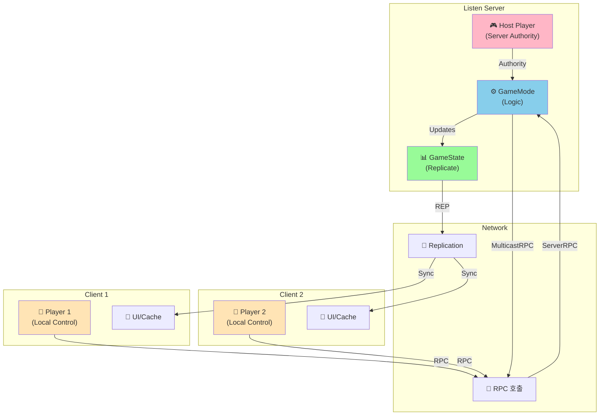

#### 주요 구현 사항
- **Replication 시스템**: Actor 및 Component 레벨에서의 데이터 동기화
- **RPC(Remote Procedure Call)**: Server/Client/Multicast RPC를 활용한 상태 전파
- **Authority 기반 로직 분리**: 서버에서만 실행되어야 하는 게임 로직 보호

```cpp
// GameState에서 Counter POS 복제
void AMHGAGameState::GetLifetimeReplicatedProps(TArray<FLifetimeProperty>& OutLifetimeProps) const
{
    Super::GetLifetimeReplicatedProps(OutLifetimeProps);
    DOREPLIFETIME(AMHGAGameState, Counter);
}
```

#### 네트워크 동기화 전략
- **재료 및 Props**: `bReplicates = true` + `SetReplicateMovement(true)`로 물리 기반 동작 동기화
  ```cpp
  // IngredientBase 생성자
  AIngredientBase::AIngredientBase()
  {
      bReplicates = true;
      AActor::SetReplicateMovement(true);
  }
  
  // BeginPlay에서 클라이언트 물리 비활성화
  void AIngredientBase::BeginPlay()
  {
      if (HasAuthority() == false)
      {
          Mesh->SetSimulatePhysics(false);
          Mesh->SetEnableGravity(false);
      }
  }
  ```
- **UI 상호작용**: PlayerController를 통한 Server RPC → Counter Actor의 Multicast RPC 체인
- **손님 AI**: 서버에서만 FSM 로직 실행, 결과만 복제

---

### 2. AI 손님 시스템

**유한 상태 머신(FSM) 기반의 손님 행동 AI**

#### 손님 종류 및 성격 시스템

**손님 성격 (ECustomerPersonality)**
```cpp
UENUM(BlueprintType)
enum class ECustomerPersonality : uint8
{
    Standard    UMETA(DisplayName = "표준"),
    Polite      UMETA(DisplayName = "공손함"),
    Rude        UMETA(DisplayName = "무례함"),
    Impatient   UMETA(DisplayName = "급함"),
    Special_VIP UMETA(DisplayName = "매그너스")  // 특별 손님
};
```

**특별 손님 시스템**
- **생성 확률**: `SpecialCustomerChance = 0.1f` (10%)
- **특별 주문**: `EBurgerMenu::WrongBurger` (항상 잘못된 버거 주문)
- **전용 메쉬 및 애니메이션**: `specialVisual` 사용
- **메쉬 인덱스**: -1 (일반 손님과 구분)

```cpp
// CustomerFSM::BeginPlay에서 손님 타입 결정
if (FMath::FRand() < SpecialCustomerChance)
{
    // 특별 손님
    personality = ECustomerPersonality::Special_VIP;
    SelectedMeshIndex = -1;  // 특별 손님 메쉬
}
else
{
    // 일반 손님
    int32 NumRegularPersonalities = static_cast<int32>(ECustomerPersonality::Special_VIP);
    personality = static_cast<ECustomerPersonality>(FMath::RandRange(0, NumRegularPersonalities - 1));
    SelectedMeshIndex = FMath::RandRange(0, me->regularVisuals.Num() - 1);
}
```

#### 손님 상태 전환 다이어그램

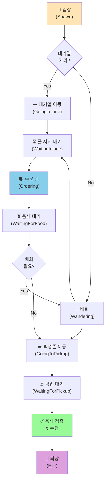

#### FSM 구조 (CustomerFSM)
총 9가지 상태를 가진 유한 상태 머신으로 손님의 행동을 제어합니다.

```cpp
enum class EAIState : uint8
{
    None,              // 초기 상태
    GoingToLine,       // 줄 서러 이동 중
    WaitingInLine,     // 줄 서서 대기 중
    Wandering,         // 배회 중
    Ordering,          // 주문 중
    WaitingForFood,    // 음식 대기 중
    GoingToPickup,     // 픽업존 이동 중
    WaitingForPickup,  // 픽업존 대기 중
    Exit               // 퇴장
};
```

#### 주요 기능

**1. 대기열 관리 시스템**
- 빈 자리가 있으면 즉시 줄서기, 없으면 배회하며 대기
- 손님이 주문 완료 시 자동으로 대기열 앞당김
- 대기 중인 손님을 순차적으로 호출

```cpp
void ACustomerManager::UpdateWaitingPosition()
{
    for (int32 i = 1; i < waitingCustomers.Num(); ++i)
    {
        if (waitingCustomers[i] != nullptr && waitingCustomers[i - 1] == nullptr)
        {
            // 앞자리로 이동 명령
            ACustomerAI* customerToMove = waitingCustomers[i];
            customerToMove->fsm->MoveToTarget(waitingPoints[i-1]);
            waitingCustomers[i-1] = waitingCustomers[i];
            waitingCustomers[i] = nullptr;
        }
    }
}
```

**2. 배회 시스템**
- NavigationSystem을 활용한 NavMesh 기반 랜덤 이동
- 3~5초 간격으로 새로운 목적지 설정
- 타이머를 활용한 비동기 처리

**3. 주문 시스템**
- Enum 기반 메뉴 선택 (BigMac, BTD, QPC, Shanghai, Shrimp)
- UMG 위젯을 통한 말풍선 UI 표시
- 주문 완료 시 자동으로 음식 대기 상태로 전환

**4. 음식 검증 시스템**
- 픽업존에서 음식 이름과 주문한 메뉴 비교
- 일치 시 만족 표시, 불일치 시 불만 표시
- 평점 시스템 연동 (ShowScoreFeedback 함수로 구현)

```cpp
void UCustomerFSM::CheckAndTakeFood()
{
    if (MyPickupZone->HasFood())
    {
        AHamburger* TakenHamburger = Cast<AHamburger>(MyPickupZone->TakeFood());
        FString OrderedMenuName = // Enum을 String으로 변환
        FString TakenBurgerName = TakenHamburger->GetBurgerName();

        if (OrderedMenuName == TakenBurgerName)
        {
            me->ShowScoreFeedback(EScoreChangeReason::CorrectFood);  // 만족
        }
        else
        {
            me->ShowScoreFeedback(EScoreChangeReason::WrongFood);  // 불만
        }
    }
}
```

**5. 손님 매니저 (CustomerManager)**
- 타이머 기반 자동 스폰 시스템
- 최대 인원 제한 관리 (MaxSpawnedCustomers)
- 픽업 대기열 관리 및 호출 시스템

---

### 3. 조리 시스템

**물리 기반 상호작용과 상태 머신을 결합한 조리 메커니즘**

#### 재료 시스템 (Ingredient System)

**재료 클래스 계층 구조**
```
IngredientBase (기본 재료 클래스, IngType = None)
├── BottomBread (IngType = BottomBread)
├── MiddleBread (IngType 미설정)
├── TopBread (IngType = TopBread)
├── Patty (IngType = Patty, 조리 상태 포함)
├── Cheese (IngType = Cheese)
├── Lettuce (IngType 미설정)
├── Tomato (IngType 미설정)
├── Onion (IngType = Onion)
├── Pickle (IngType = Pickle)
└── SauceBottle (IngType = None, 발사 기능)
```

**주요 구현 재료**
- `BottomBread`, `TopBread`: 햄버거 상하 빵
- `Patty`: 3단계 조리 상태 (Raw → Cooked → Overcooked)
- `Cheese`, `Onion`, `Pickle`: 토핑 재료
- `SauceBottle`: Line Trace 기반 소스 발사

**재료 Enum 정의**
```cpp
enum class EIngredient : uint8
{
    None, BottomBread, MiddleBread, TopBread,
    Patty, Lettuce, Tomato, Onion,
    Cheese, Pickle, Sauce, ShanghaiPortion, ShrimpPortion
};
```

#### 패티 조리 시스템

**Patty 클래스** 및 **CookingArea**를 통한 3단계 조리 상태 구현

```cpp
enum class EPattyCookState : uint8
{
    Raw,        // 날것
    Cooked,     // 적절히 구워짐
    Overcooked  // 타버림
};
```

**패티 조리의 특징**
- **앞뒷면 개별 관리**: 패티의 앞면과 뒷면을 각각 따로 요리
- **뒤집기 메커니즘**: Flip() 함수로 앞뒷면 상태를 전환
- **타이머 기반 조리**: cookTime(3초)과 overcookTime(5초) 기본값
- **상태별 텍스처 변경**: Raw → Cooked → Overcooked 상태에 따라 텍스처 동적 변경

**패티 조리 타임라인**

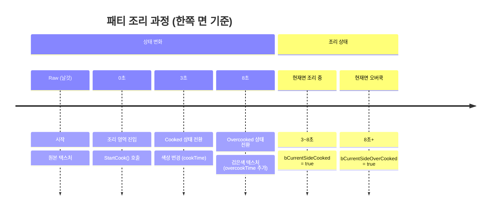

**패티 조리 상태 업데이트 로직**
```cpp
// Patty.h - 앞뒷면 상태 추적
UPROPERTY(ReplicatedUsing = OnRep_CookStateChanged)
bool bIsFrontCooked;      // 앞면 구워짐
UPROPERTY(ReplicatedUsing = OnRep_CookStateChanged)
bool bIsBackCooked;       // 뒷면 구워짐
UPROPERTY(ReplicatedUsing = OnRep_CookStateChanged)
bool bIsFrontOverCooked;  // 앞면 오버쿡
UPROPERTY(ReplicatedUsing = OnRep_CookStateChanged)
bool bIsBackOverCooked;   // 뒷면 오버쿡

// 종합 상태 계산
UPROPERTY(Replicated)
EPattyCookState CookState;  // Raw / Cooked / Overcooked

// CookingArea와의 상호작용
void ACookingArea::OnOverlapBegin(...)
{
    AIngredientBase* ingredient = Cast<AIngredientBase>(OtherActor);
    if (ingredient)
        ingredient->StartCook();  // 패티의 StartCook() 호출
}
```

#### 소스 발사 시스템

**SauceBottle 클래스**의 특수 기능
- Arrow Component로 발사 방향 시각화
- ShootSauce() 함수로 소스 인스턴스 스폰
- 실시간 물리 기반 소스 생성

```cpp
class ASauceBottle : public AIngredientBase
{
public:
    // 소스 발사 함수
    void ShootSauce();

    virtual void OnUse() override;  // 마우스 클릭 시 호출

protected:
    UPROPERTY(VisibleAnywhere)
    class UArrowComponent* Arrow;  // 발사 방향 표시

    UPROPERTY(EditAnywhere, BlueprintReadWrite)
    TSubclassOf<class AIngredientBase> SauceClass;  // 스폰될 소스 클래스
};
```

---

### 4. 포장 및 레시피 검증 시스템

**WrappingPaper 클래스를 통한 햄버거 완성 및 검증**

#### 작동 원리

**1. 재료 추적**
- Box Collision을 통한 Overlap 이벤트 감지
- 재료 종류별 수량 카운트
- TArray<FIngredientStack> 구조로 관리

```cpp
struct FIngredientStack
{
    EIngredient IngredientId;
    int32 Quantity;
};
```

**2. 포장 조건 검증**
```cpp
bool AWrappingPaper::HasBreadPair() const
{
    // TopBread와 BottomBread가 각각 1개 이상 필요
    int32 Q_TBread = 0, Q_BBread = 0;
    for (const FIngredientStack& tmp : OnAreaIngredients)
    {
        if (tmp.IngredientId == EIngredient::TopBread) Q_TBread++;
        if (tmp.IngredientId == EIngredient::BottomBread) Q_BBread++;
    }
    return Q_TBread >= 1 && Q_BBread >= 1;
}

bool AWrappingPaper::HasExtraIngredient() const
{
    // 빵 외에 다른 재료가 1개 이상 필요
    int32 count = 0;
    for (const FIngredientStack& tmp : OnAreaIngredients)
    {
        if (!(tmp.IngredientId == EIngredient::BottomBread || 
              tmp.IngredientId == EIngredient::TopBread))
            count++;
    }
    return count > 0;
}
```

**3. 레시피 매칭 알고리즘**

DataTable을 활용한 정확한 레시피 비교

**레시피 매칭 프로세스**

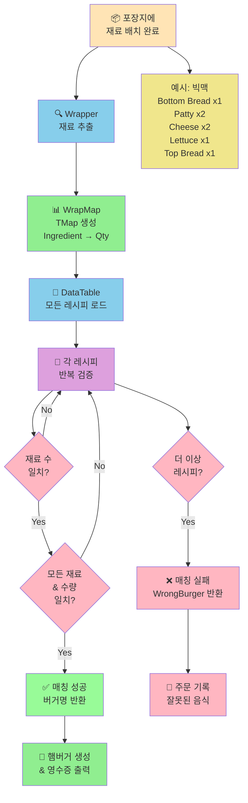

**레시피 매칭 코드**

```cpp
EBurgerMenu AWrappingPaper::FindMatchingRecipe(
    UDataTable* DT,
    const TArray<FIngredientStack>& WrapperIngr)
{
    TMap<EIngredient, int32> WrapMap = MakeMapFromArray(WrapperIngr);
    TArray<FBurgerRecipe*> AllRows;
    DT->GetAllRows<FBurgerRecipe>(TEXT("FBurgerRecipe"), AllRows);

    for (FBurgerRecipe* Row : AllRows)
    {
        TMap<EIngredient, int32> RecipeMap = MakeMapFromArray(Row->Ingredients);

        // 재료 수가 다르면 스킵
        if (RecipeMap.Num() != WrapMap.Num()) continue;

        // 모든 재료와 수량이 정확히 일치하는지 검증
        bool isMatched = true;
        for (const auto& Pair : RecipeMap)
        {
            const int32* WrapQty = WrapMap.Find(Pair.Key);
            if (WrapQty == nullptr || *WrapQty != Pair.Value)
            {
                isMatched = false;
                break;
            }
        }

        if (isMatched) return Row->BurgerName;
    }

    return EBurgerMenu::WrongBurger;
}
```

**4. 햄버거 생성 및 정리**
```cpp
void AWrappingPaper::CompleteWrapping()
{
    // 레시피 매칭
    EBurgerMenu CreatedBurgerName = FindMatchingRecipe(
        BurgerDataTable, 
        OnAreaIngredients
    );
    
    // 햄버거 스폰
    AHamburger* SpawnedBurger = GetWorld()->SpawnActor<AHamburger>(
        BurgerClass, 
        this->GetActorTransform()
    );
    SpawnedBurger->SetName(BurgerMenuName);
    
    // 재료 및 포장지 정리
    DestroyIngredients();
}
```

#### 지원 메뉴
```cpp
enum class EBurgerMenu : uint8
{
    None,
    WrongBurger,  // 잘못된 조합
    BigMac,       // 빅맥
    BTD,          // 베이컨 토마토 디럭스
    QPC,          // 쿼터 파운드 치즈
    Shanghai,     // 상하이 버거
    Shrimp        // 새우 버거
};
```

---

### 5. POS(Point of Sale) 시스템

**3D Widget Interaction을 활용한 실시간 주문 관리**

#### 시스템 구조

**CounterPOS (Actor)**
- Static Mesh로 된 카운터 모델
- Widget Component를 통한 3D UI 표시
- 네트워크 복제를 통한 모든 클라이언트 동기화

```cpp
ACounterPOS::ACounterPOS()
{
    MeshComponent = CreateDefaultSubobject<UStaticMeshComponent>(TEXT("Mesh"));
    WidgetComponent = CreateDefaultSubobject<UWidgetComponent>(TEXT("Widget"));
    
    bReplicates = true;
    bAlwaysRelevant = true;
    WidgetComponent->SetIsReplicated(true);
}
```

#### 주문 관리 구조

**FOrderArray 구조체**
```cpp
struct FOrderArray
{
    ACustomerAI* Customer;           // 주문한 손님
    TArray<EBurgerMenu> Menus;       // 주문 메뉴 리스트
};

// CounterPOS에서 관리
TMap<int32, FOrderArray> OrderMap;  // 주문번호 → 주문정보
```

#### UI 구성

**1. CounterUI (메인 UI)**
- **CustomerCanvas**: 주문 완료 목록 표시
  - UniformGridPanel로 5열 그리드 구성
  - 각 주문은 CustomerButtonUI로 표현
  
- **OrderCanvas**: 메뉴 선택 및 주문 접수
  - MenuGrid: 동적으로 생성되는 메뉴 버튼
  - SelectedListBox: 현재 선택된 메뉴 리스트
  - 주문/삭제 버튼

**2. MenuButtonUI (메뉴 버튼)**
```cpp
void UMenuButtonUI::Init(const EBurgerMenu InName, UCounterUI* InOwner)
{
    MenuName = InName;
    CounterUI = InOwner;
    // Enum을 DisplayName으로 변환하여 표시
    TEXT_MenuName->SetText(
        StaticEnum<EBurgerMenu>()->GetDisplayNameTextByValue(
            static_cast<int64>(MenuName)
        )
    );
}
```

**3. CustomerButtonUI (주문 번호 버튼)**
```cpp
class UCustomerButtonUI : public UUserWidget
{
    int32 Num;                      // 주문 번호
    TArray<EBurgerMenu> Menus;      // 주문 메뉴
    ACustomerAI* Customer;          // 손님 참조 (미사용)
    
    void Init(TArray<EBurgerMenu> InMenu, int32 InNum, UCounterUI* InOwner);
};
```
- 주문 번호 표시
- 클릭 시 해당 주문의 메뉴 리스트 표시
- 준비 완료 처리 기능

#### 네트워크 동기화 흐름

**주문 접수 및 완료 프로세스**

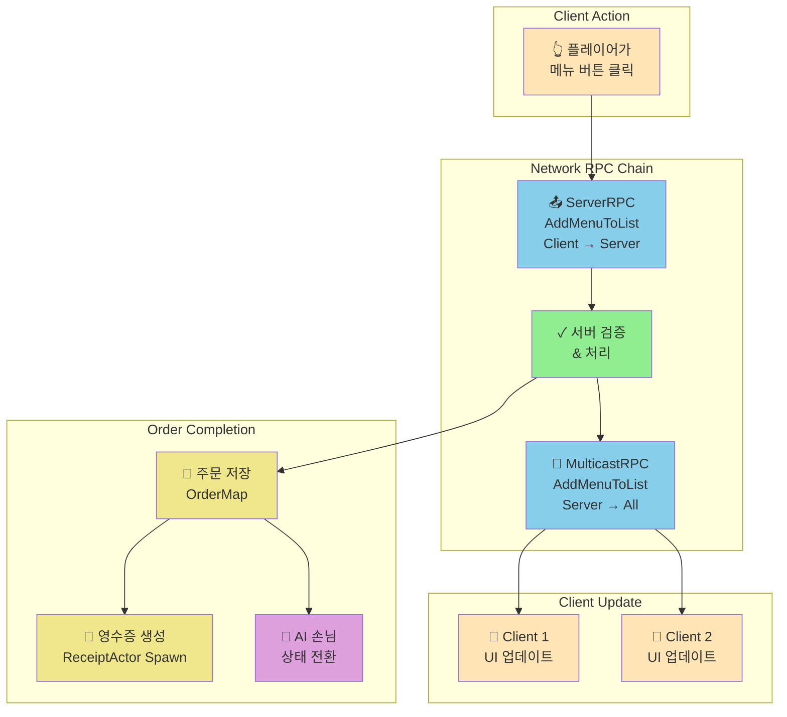

**주문 완료 상세 프로세스**
```cpp
void UCounterUI::OrderMenuBtnRPC()
{
    // 주문 저장
    PosActor->OrderMap.FindOrAdd(PosActor->OrderNum) = 
        {PosActor->GetCustomer(), OrderList};
    
    // 주문 번호 버튼 생성
    UCustomerButtonUI* NewCustomerBtn = CreateWidget<UCustomerButtonUI>(...);
    NewCustomerBtn->Init(OrderList, PosActor->OrderNum, this);
    CustomerGrid->AddChildToUniformGrid(NewCustomerBtn, Row, Col);
    
    // 영수증 출력 (서버에서만)
    if (PosActor->HasAuthority())
    {
        AReceiptActor* NewReceipt = GetWorld()->SpawnActor<AReceiptActor>(...);
        NewReceipt->MulticastRPC_Init(OrderNum, MenuStrings);
    }
    
    // AI 손님 주문 완료 처리
    if (PosActor->GetCustomer() != nullptr)
        PosActor->GetCustomer()->fsm->FinishOrder();
}
```

#### 영수증 시스템

**ReceiptActor 클래스**
- Canvas Render Target을 활용한 동적 텍스트 렌더링
- 주문 번호와 메뉴 리스트를 텍스처로 변환
- 물리 시뮬레이션 적용으로 현실감 있는 출력 효과

```cpp
void AReceiptActor::OnUpdateCanvas(UCanvas* Canvas, int32 Width, int32 Height)
{
    // 배경 흰색
    FCanvasTileItem TileItem(FVector2D(0, 0), 
                             FVector2D(Width, Height), 
                             FLinearColor::White);
    Canvas->DrawItem(TileItem);
    
    // 주문 번호 크게 표시
    FString OrderText = FString::Printf(TEXT("#%d"), OrderNum);
    // ... 텍스트 렌더링
    
    // 메뉴 리스트 표시
    for (const FString& M : MenuList)
    {
        FCanvasTextItem MenuItem(...);
        Canvas->DrawItem(MenuItem);
    }
}
```

---

### 5.1 로딩 화면 시스템

#### LoadingWidget 클래스
- **목적**: 레벨 전환 시 표시되는 로딩 UI
- **구현 위치**: 
  - `Source/MHGA/Public/LoadingWidget.h`
  - `Source/MHGA/Private/LoadingWidget.cpp`
- **Blueprint**: `/Game/UI/WBP_LoadingUI`

#### LoadingBurger 클래스  
- **목적**: 로딩 화면에서 회전하는 3D 버거 표시
- **주요 컴포넌트**:
  - `SceneCaptureComponent2D`: 버거를 렌더 타겟에 캡처
  - `StaticMeshComponent`: 회전하는 버거 메쉬
  - `RotationSpeed`: 초당 90도 회전
- **구현 위치**: 
  - `Source/MHGA/Public/LoadingBurger.h`
  - `Source/MHGA/Private/LoadingBurger.cpp`

**로딩 화면 관리 (MHGAGameInstance)**
```cpp
// MHGAGameInstance.h
private:
    UPROPERTY(EditDefaultsOnly, Category = "UI")
    TSubclassOf<class ULoadingWidget> LoadingWidgetClass;
    
    UPROPERTY()
    class ULoadingWidget* LoadingWidget;

public:
    void ShowLoadingScreen();
    void HideLoadingScreen();
```

**로딩 화면 표시/숨김 구현**
```cpp
void UMHGAGameInstance::ShowLoadingScreen()
{
    UWorld* World = GetWorld();
    if (!World) return;

    APlayerController* PC = World->GetFirstPlayerController();
    if (!PC) return;

    // Loading Widget 생성
    if (!LoadingWidget && LoadingWidgetClass)
    {
        LoadingWidget = CreateWidget<ULoadingWidget>(PC, LoadingWidgetClass);
    }

    // Widget 표시 (최상위 Z-Order)
    if (LoadingWidget)
    {
        LoadingWidget->AddToViewport(9999);
    }
}

void UMHGAGameInstance::HideLoadingScreen()
{
    // Loading Widget 제거
    if (LoadingWidget && LoadingWidget->IsInViewport())
    {
        LoadingWidget->RemoveFromParent();
    }

    // 입력 모드 복구
    if (UWorld* World = GetWorld())
    {
        if (APlayerController* PC = World->GetFirstPlayerController())
        {
            PC->SetInputMode(FInputModeGameOnly());
            PC->bShowMouseCursor = false;
        }
    }
}
```

**PlayerController RPC**
```cpp
// 클라이언트에 로딩 표시 요청
UFUNCTION(Client, Reliable)
void ClientShowLoading();

// 클라이언트에 로딩 숨김 요청  
UFUNCTION(Client, Reliable)
void ClientHideLoading();
```

#### 사용 시점 및 흐름

1. **로비 → 메인 레벨 전환**
```cpp
void ULobbyUI::OnClickReady()
{
    if (LobbyBoard->HasAuthority())
    {
        // 모든 플레이어에게 로딩창 표시 요청
        for (FConstPlayerControllerIterator It = GetWorld()->GetPlayerControllerIterator(); It; ++It)
        {
            if (AMHGAPlayerController* PC = Cast<AMHGAPlayerController>(It->Get()))
            {
                PC->ClientShowLoading();
            }
        }

        // 약간의 지연 후 서버 트래블
        FTimerHandle TimerHandle;
        GetWorld()->GetTimerManager().SetTimer(TimerHandle, [this]()
        {
            GetWorld()->ServerTravel(TEXT("/Game/Maps/Main"), true);
        }, 0.1f, false);
    }
}
```

2. **메인 레벨 도착 후 로딩 숨김**
```cpp
void AMHGAGameMode::PostLogin(APlayerController* NewPlayer)
{
    Super::PostLogin(NewPlayer);

    if (AMHGAPlayerController* PC = Cast<AMHGAPlayerController>(NewPlayer))
    {
        // 약간의 지연 후 로딩창 숨김
        FTimerHandle TimerHandle;
        GetWorld()->GetTimerManager().SetTimer(TimerHandle, [PC]()
        {
            if (PC)
            {
                PC->ClientHideLoading();
            }
        }, 3.0f, false); // 3초 후 숨김
    }
}
```

3. **게임 종료 → 로비 복귀**
```cpp
void AMHGAGameMode::HandleGameOver(FString reason)
{
    // ... 게임 오버 처리 ...
    
    if (HasAuthority())
    {
        FTimerHandle handle;
        GetWorldTimerManager().SetTimer(handle, [this]()
        {
            GetWorld()->ServerTravel(TEXT("/Game/Maps/Lobby"), true);
        }, 10, false);
    }
}
```

---

### 5.2 게임 오버 시스템

#### GameOverWidget 클래스
- **목적**: 게임 종료 시 점수 표시 및 결과 화면
- **구현 위치**: 
  - `Source/MHGA/Public/GameOverWidget.h`
  - `Source/MHGA/Private/GameOverWidget.cpp`
- **실제 구현**: `PlayerWidget` 클래스 내에 통합되어 있음
  - `finalScore` Canvas Panel
  - `orderScoreBox`, `cookScoreBox`, `foodScoreBox` TextBlock
  - `FinalScoreAnim` 애니메이션

#### MHGAGameState - 게임 상태 관리
- **평점 시스템**: 
  - `orderSpeedScore`: 주문 속도 평점
  - `cookSpeedScore`: 조리 속도 평점  
  - `foodScore`: 음식 정확도 평점
  - `finalScore`: 총 평점
- **게임 상태 플래그**:
  - `bIsGamePlaying`: 게임 진행 중 여부
  - `bIsGameOver`: 게임 종료 여부

**게임 오버 처리 흐름**
```cpp
// 1. 서버에서 게임 오버 감지 및 처리
void AMHGAGameMode::HandleGameOver(FString reason)
{
    AMHGAGameState* gs = GetGameState<AMHGAGameState>();
    if (gs && !gs->bIsGameOver)
    {
        gs->bIsGameOver = true;  // 플래그 설정 (RepNotify 발동)
        
        // 모든 손님 퇴장
        ACustomerManager* CustomerManager = Cast<ACustomerManager>(
            UGameplayStatics::GetActorOfClass(GetWorld(), ACustomerManager::StaticClass())
        );
        if (CustomerManager)
        {
            CustomerManager->KickAllCustomers();
        }
        
        // 클라이언트에서 OnRep_GameOver 호출됨
        gs->OnRep_GameOver();
        
        // 10초 후 로비로 이동
        if (HasAuthority())
        {
            FTimerHandle handle;
            GetWorldTimerManager().SetTimer(handle, [this]()
            {
                GetWorld()->ServerTravel(TEXT("/Game/Maps/Lobby"), true);
            }, 10, false);
        }
    }
}

// 2. 클라이언트 게임 오버 처리
void AMHGAGameState::OnRep_GameOver()
{
    if (bIsGameOver)
    {
        // 최종 점수 UI 표시
        playerWidget->finalScore->SetVisibility(ESlateVisibility::Visible);
        playerWidget->PlayFinalScoreAnim();
        
        // 플레이어 컨트롤러에 게임 오버 처리 요청
        AMHGAPlayerController* pc = Cast<AMHGAPlayerController>(
            UGameplayStatics::GetPlayerController(GetWorld(), 0)
        );
        if (pc)
        {
            // 플레이어 입력 처리는 GameMode에서 처리
        }
    }
}
```

#### 평점 시스템

**평점 변경 이유 enum**
```cpp
UENUM(BlueprintType)
enum class EScoreChangeReason : uint8
{
    SlowOrder   UMETA(DisplayName="주문 지연"),
    SlowCook    UMETA(DisplayName="조리 지연"),
    WrongFood   UMETA(DisplayName="잘못된 음식"),
    CorrectFood UMETA(DisplayName="올바른 음식")
};
```

**점수 시스템 다이어그램**

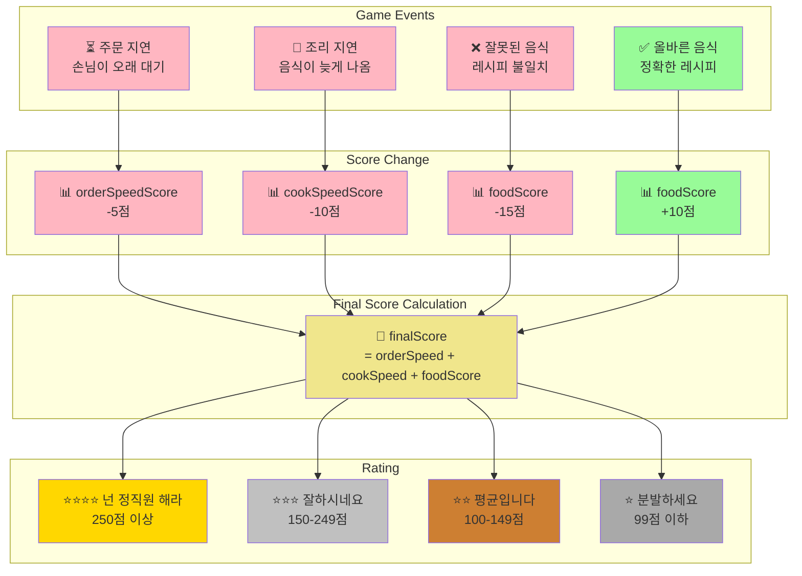

**GameMode의 평점 설정 변수**
```cpp
// MHGAGameMode.h
UPROPERTY(EditAnywhere, Category = "Game Config")
int32 penaltySlowOrder = -5;      // 주문 지연 패널티
UPROPERTY(EditAnywhere, Category = "Game Config")
int32 penaltySlowCook = -10;      // 조리 지연 패널티
UPROPERTY(EditAnywhere, Category = "Game Config")
int32 penaltyWrongFood = -15;     // 잘못된 음식 패널티
UPROPERTY(EditAnywhere, Category = "Game Config")
int32 bonusCorrectFood = 10;      // 올바른 음식 보너스
```

**평점 변경 처리**
```cpp
void AMHGAGameMode::ReportScoreChanged(EScoreChangeReason reason, int32 changeScore)
{
    if (!HasAuthority()) return;
    AMHGAGameState* gs = GetGameState<AMHGAGameState>();
    if (!gs || gs->bIsGameOver) return;

    int32* targetScore = nullptr;

    switch (reason)
    {
    case EScoreChangeReason::SlowOrder:
        targetScore = &gs->orderSpeedScore;
        changeScore = penaltySlowOrder;
        break;
    case EScoreChangeReason::SlowCook:
        targetScore = &gs->cookSpeedScore;
        changeScore = penaltySlowCook;
        break;
    case EScoreChangeReason::WrongFood:
        targetScore = &gs->foodScore;
        changeScore = penaltyWrongFood;
        break;
    case EScoreChangeReason::CorrectFood:
        targetScore = &gs->foodScore;
        changeScore = bonusCorrectFood;
        break;
    }

    if (targetScore && changeScore != 0)
    {
        *targetScore += changeScore;
        gs->finalScore = gs->orderSpeedScore + gs->cookSpeedScore + gs->foodScore;
    }
}
```

**최종 평가 기준**
```cpp
FText AMHGAGameState::GetFinalRank()
{
    if (finalScore >= 250)
        return FText::FromString(TEXT("넌 정직원 해라"));
    else if (finalScore >= 150)
        return FText::FromString(TEXT("잘하시네요"));
    else if (finalScore >= 100)
        return FText::FromString(TEXT("평균입니다"));
    else
        return FText::FromString(TEXT("분발하세요"));
}
```

---

### 6. 상호작용 시스템

**InteractComponent를 통한 통합 상호작용 관리**

#### 시스템 개요

플레이어가 월드의 다양한 오브젝트와 상호작용할 수 있는 컴포넌트 기반 시스템

**지원 상호작용**
- 재료/도구 집기 (Grab)
- 재료 컨테이너에서 꺼내기
- 도구 사용 (Use)
- 오브젝트 내려놓기 (Put)

#### 상호작용 플로우

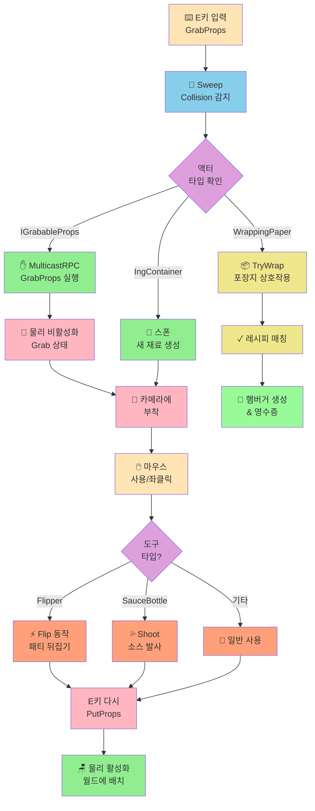

#### IGrabableProps 인터페이스

```cpp
class IGrabableProps
{
    virtual void OnGrabbed(AMHGACharacter* Player) = 0;  // 집힐 때
    virtual void OnPut() = 0;                             // 내려놓을 때
    virtual void OnUse() = 0;                             // 사용할 때
    virtual void SetLocation(FVector Loc) = 0;            // 위치 설정
};
```

```cpp
class AIngredientBase : public AActor, public IGrabableProps
{
    UPROPERTY(EditAnywhere)
    UStaticMeshComponent* Mesh;
    
    UPROPERTY(EditAnywhere)
    EIngredient IngType = EIngredient::None;
    
    UPROPERTY(EditAnywhere)
    AMHGACharacter* GrabCharacter;  // 현재 집고 있는 캐릭터
};
```

**인터페이스 구현 클래스**
- `AIngredientBase` 및 모든 하위 재료 클래스
- `AHamburger` (완성된 햄버거)
- `AFlipper` (패티 뒤집개, 자체 GrabCharacter 필드 보유)
- `AReceiptActor` (영수증)

#### 집기 시스템 구현

**1. Sweep 기반 탐지**
```cpp
void UInteractComponent::GrabProps()
{
    FVector Start = Owner->GetFirstPersonCameraComponent()->GetComponentLocation();
    FVector End = Start + Owner->GetCamera()->GetForwardVector() * GrabDistance;
    
    FCollisionShape Sphere = FCollisionShape::MakeSphere(GrabRadius);
    
    if (GetWorld()->SweepSingleByChannel(Hit, Start, End, ...))
    {
        // WrappingPaper 특수 처리
        if (AWrappingPaper* wp = Cast<AWrappingPaper>(Hit.GetActor()))
        {
            wp->TryWrap();  // 포장 시도
            return;
        }
        
        // IGrabableProps 인터페이스 체크
        if (Cast<IGrabableProps>(Hit.GetActor()))
            MulticastRPC_GrabProps(Hit);
            
        // IngContainer 특수 처리
        else if (AIngContainer* Container = Cast<AIngContainer>(Hit.GetActor()))
        {
            AIngredientBase* Ing = Container->GetIngredient();
            MulticastRPC_InteractIngContainer(Ing);
        }
    }
}
```

**2. 네트워크 동기화**
```cpp
void UInteractComponent::MulticastRPC_GrabProps_Implementation(FHitResult Hit)
{
    IGrabableProps* GrabInterface = Cast<IGrabableProps>(Hit.GetActor());
    GrabInterface->OnGrabbed(Owner);
    
    // 물리 끄기
    Hit.GetComponent()->SetSimulatePhysics(false);
    Hit.GetComponent()->SetCollisionProfileName(TEXT("Grabbed"));
    
    // 카메라에 부착
    HoldDistance = FVector::Dist(CameraLocation, ActorLocation);
    HoldDistance = FMath::Clamp(HoldDistance, 50, 200);
    
    Cast<AActor>(GrabInterface)->AttachToComponent(
        Owner->GetFirstPersonCameraComponent(), 
        FAttachmentTransformRules::SnapToTargetNotIncludingScale
    );
    
    GrabInterface->SetLocation(
        CameraLocation + CameraForward * HoldDistance
    );
    
    bIsGrabbed = true;
    GrabbedProp = GrabInterface;
}

// IngredientBase의 OnGrabbed - 다른 플레이어가 집고 있으면 처리
void AIngredientBase::OnGrabbed(AMHGACharacter* Player)
{
    if (GrabCharacter != Player && GrabCharacter != nullptr)
    {
        // 이전에 집고 있던 캐릭터가 있으면 내려놓게 함
        GrabCharacter->GetInteractComponent()->PutProps();
    }
    GrabCharacter = Player;
}
```

**3. 내려놓기**
```cpp
void UInteractComponent::PutProps()
{
    if (GrabbedProp)
    {
        GrabbedProp->OnPut();
        
        AActor* P = Cast<AActor>(GrabbedProp);
        if (UPrimitiveComponent* Root = Cast<UPrimitiveComponent>(P->GetRootComponent()))
        {
            // 물리 다시 켜기
            Root->SetSimulatePhysics(true);
            Root->SetCollisionProfileName(TEXT("BlockAllDynamic"));
            P->DetachFromActor(FDetachmentTransformRules::KeepWorldTransform);
        }
        
        bIsGrabbed = false;
        GrabbedProp = nullptr;
    }
}
```

#### 특수 도구: Flipper (뒤집개)

**패티 뒤집기 구현**
```cpp
void AFlipper::OnUse()
{
    FVector Start = GrabCharacter->GetCamera()->GetComponentLocation();
    FVector End = Start + GrabCharacter->GetCamera()->GetForwardVector() * 200;
    
    if (GetWorld()->SweepSingleByChannel(Hit, Start, End, ...))
    {
        if (Hit.GetComponent()->IsSimulatingPhysics())
        {
            // 카메라의 Right 벡터 기준으로 180도 회전
            FRotationMatrix CamMatrix(CameraRotation);
            FVector RightVector = CamMatrix.GetScaledAxis(EAxis::Y);
            
            FQuat CurrentQuat = Hit.GetActor()->GetActorQuat();
            FQuat FlipQuat = FQuat(RightVector, FMath::DegreesToRadians(180.f));
            FQuat NewQuat = FlipQuat * CurrentQuat;
            
            Hit.GetActor()->SetActorRotation(NewQuat);
        }
    }
}
```

#### 재료 컨테이너 시스템

**AIngContainer 클래스**
- 무한 재료 공급 시스템
- Interact 시 새 재료 인스턴스 스폰

```cpp
class AIngContainer : public AActor
{
    UPROPERTY(EditAnywhere)
    TSubclassOf<AIngredientBase> Ingredient;
    
    AIngredientBase* GetIngredient()
    {
        return GetWorld()->SpawnActor<AIngredientBase>(Ingredient);
    }
};
```

---

### 7. 캐릭터 및 입력 시스템

**Enhanced Input System 기반의 1인칭 캐릭터 컨트롤**

#### MHGACharacter 구조

**컴포넌트 구성**
- **UCameraComponent**: 1인칭 시점 카메라
  - FirstPersonFieldOfView: 70도
  - FirstPersonScale: 0.6 (손 크기 조절)
- **UInteractComponent**: 오브젝트 상호작용
- **UWidgetInteractionComponent**: 3D UI 상호작용
- **USkeletalMeshComponent**: 1인칭 바디 메시

#### Enhanced Input Actions

```cpp
// 이동
IA_Move   : Vector2D (WASD)
// 시점
IA_Look   : Vector2D (마우스)
// 집기/놓기
IA_Pick   : Button (E)
// 사용
IA_Use    : Button (마우스 좌클릭)
// 앉기
IA_Crouch : Button (Ctrl)
// 게임 시작 (호스트만)
IA_Start  : Button (G) 
// 음성 채팅
IA_Voice  : Button (V - Hold)
// UI 모드 전환
IA_UI     : Button (Tab - Hold)
```

**입력 처리 예시**
```cpp
void AMHGACharacter::PickInput(const FInputActionValue& Value)
{
    if (IsLocallyControlled())
        InteractComponent->ServerRPC_InteractProps();
}

void AMHGACharacter::UseInput(const FInputActionValue& Value)
{
    if (IsLocallyControlled())
    {
        // 3D UI 상호작용
        WidgetInteraction->PressPointerKey(EKeys::LeftMouseButton);
        
        // Props 사용
        InteractComponent->ServerRPC_UseProps();
    }
}

void AMHGACharacter::StartInput(const FInputActionValue& Value)
{
    if (HasAuthority())  // 서버(호스트)에서만 실행
    {
        AMHGAGameMode* gm = Cast<AMHGAGameMode>(UGameplayStatics::GetGameMode(this));
        AMHGAGameState* gs = Cast<AMHGAGameState>(UGameplayStatics::GetGameState(this));
        if (gm && gs && !gs->bIsGamePlaying)
        {
            gm->GameStart();  // 게임 시작
        }
    }
}

void AMHGACharacter::StartVoiceInput()
{
    AMHGAPlayerController* pc = GetController<AMHGAPlayerController>();
    pc->StartTalking();  // 음성 채팅 시작
}

void AMHGACharacter::StartUIInput()
{
    APlayerController* pc = GetWorld()->GetFirstPlayerController();
    UWidgetBlueprintLibrary::SetInputMode_GameAndUIEx(pc);
    pc->SetShowMouseCursor(true);  // 마우스 커서 표시
}
```

#### Widget Interaction 구성

**3D POS 시스템 상호작용**
```cpp
WidgetInteraction = CreateDefaultSubobject<UWidgetInteractionComponent>(...);
WidgetInteraction->SetupAttachment(FPSCamComponent);
WidgetInteraction->InteractionDistance = 200.f;
WidgetInteraction->bShowDebug = true;  // 디버그 라인 표시
```

**동작 방식**
1. 카메라 중앙에서 Ray 발사
2. Widget Component와 충돌 시 클릭 이벤트 전달
3. 로컬 플레이어에서만 활성화

#### 애니메이션 시스템 (PlayerAnim)

**Blend Space 기반 이동 애니메이션**
```cpp
class UPlayerAnim : public UAnimInstance
{
    UPROPERTY(BlueprintReadOnly)
    float Speed = 0;      // 전진/후진 속도
    
    UPROPERTY(BlueprintReadOnly)
    float Dir = 0;        // 좌우 이동
    
    UPROPERTY(BlueprintReadOnly)
    float CameraRotX = 0; // 카메라 상하 회전
    
    UPROPERTY(BlueprintReadOnly)
    bool bIsCrouch = false;
};
```

**애니메이션 업데이트**
```cpp
void UPlayerAnim::NativeUpdateAnimation(float DeltaSeconds)
{
    if (OwnerPlayer)
    {
        // 전후 이동 속도 (정규화)
        Speed = FVector::DotProduct(
            OwnerPlayer->GetVelocity(), 
            OwnerPlayer->GetActorForwardVector()
        ) / OwnerPlayer->GetCharacterMovement()->GetMaxSpeed();
        
        // 좌우 이동 속도 (정규화)
        Dir = FVector::DotProduct(
            OwnerPlayer->GetVelocity(), 
            OwnerPlayer->GetActorRightVector()
        ) / OwnerPlayer->GetCharacterMovement()->GetMaxSpeed();
        
        // 카메라 피치
        CameraRotX = -OwnerPlayer->GetBaseAimRotation().Pitch;
        
        // 앉기 상태
        bIsCrouch = OwnerPlayer->GetCharacterMovement()->IsCrouching();
    }
}
```

---

## 시스템 아키텍처

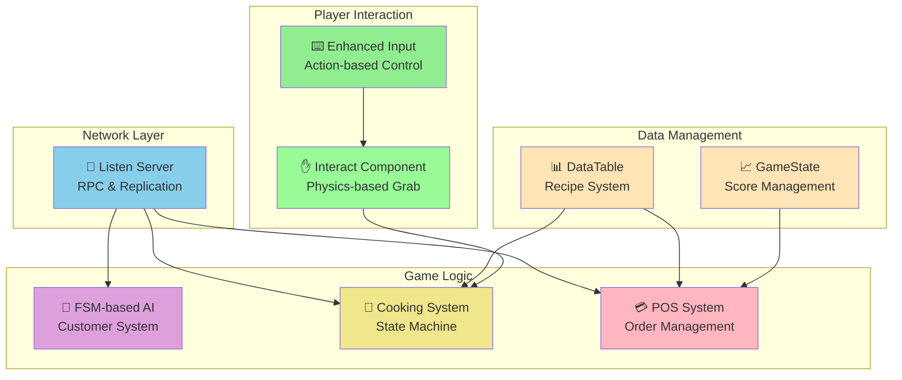

## 주요 기술 포인트

| 카테고리 | 기술 | 특징 |
|---------|------|------|
| **네트워크** | Listen Server + RPC | 멀티플레이어 동기화 |
| **AI** | FSM (9가지 상태) | 지능형 손님 행동 |
| **물리** | Physics-based Grab | 실감있는 상호작용 |
| **UI** | Widget Component 3D | 몰입형 POS 시스템 |
| **데이터** | DataTable 기반 | 확장 가능한 레시피 관리 |
| **게임플레이** | 상태 머신 조리 | 타이밍 기반 게임 메커니즘 |

---

## 🎯 Tech Highlights

### 1. 데이터 주도 설계 (Data-Driven Design)

**DataTable을 활용한 레시피 관리**

```cpp
// BurgerData.h
USTRUCT(BlueprintType)
struct FBurgerRecipe : public FTableRowBase
{
    UPROPERTY(EditAnywhere, BlueprintReadWrite)
    EBurgerMenu BurgerName;
    
    UPROPERTY(EditAnywhere, BlueprintReadWrite)
    TArray<FIngredientStack> Ingredients;
};
```

**장점**
- 프로그래머 없이 디자이너가 메뉴 추가/수정 가능
- 확장성 (신규 메뉴 추가 용이)

### 2. 네트워크 설계

**RPC 호출 체인 최적화**
```
Client Input 
→ ServerRPC (PlayerController) 
→ MulticastRPC (Counter Actor) 
→ All Clients Update UI
```

**이점**
- 서버에서 데이터 검증
- 모든 클라이언트 자동 동기화
- 클라이언트 간 불일치 방지

### 3. FSM 기반 AI 설계

**상태 전환 로직**
```cpp
void UCustomerFSM::SetState(EAIState NewState)
{
    if (CurrentState == NewState) return;
    
    StopWandering();
    CurrentState = NewState;
    
    switch (CurrentState)
    {
    case EAIState::GoingToLine:
        MoveToTarget(orderTarget);
        break;
    case EAIState::Ordering:
        StartOrder();
        break;
    // ...
    }
}
```

**장점**
- 디버깅 용이
- 상태 추가/수정 간단
- 명확한 행동 패턴

### 4. 컴포넌트 기반 아키텍처

**재사용 가능한 컴포넌트 설계**
- InteractComponent: 모든 상호작용 통합 관리
- CustomerFSM: AI 행동 로직 분리
- WidgetInteraction: 3D UI 상호작용

### 5. 물리 기반 게임플레이

**리얼리즘을 위한 물리 시뮬레이션**
- 모든 재료는 실제 물리 법칙 적용
- 집기/놓기 시 물리 on/off 전환
- 영수증, 햄버거 등 완성품도 물리 적용

---

## 🔧 사용 기술 스택

### 엔진 및 언어

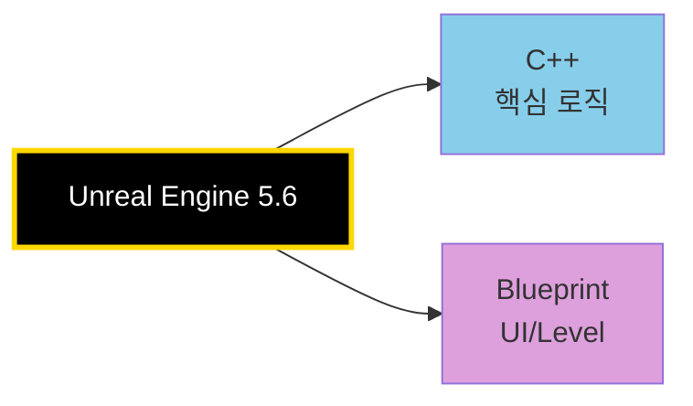

### Unreal Engine 모듈 (Dependencies)

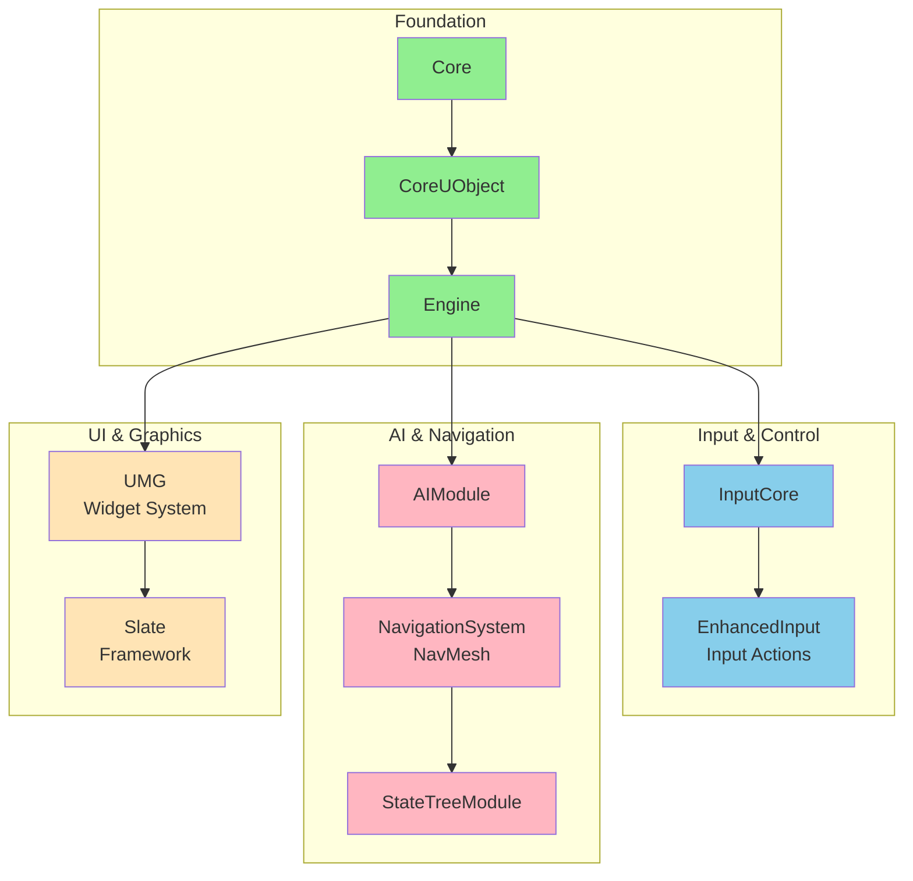

**주요 모듈별 역할**

| 모듈 | 용도 |
|------|------|
| **EnhancedInput** | Input Action 기반 입력 처리, 상황별 입력 전환 |
| **AIModule** | AI 이동 및 행동 제어 |
| **NavigationSystem** | NavMesh 기반 경로 탐색, 배회 구현 |
| **StateTreeModule** | 상태 머신 및 행동 트리 |
| **UMG** | 3D Widget Component, 주문 UI, 손님 말풍선 |
| **Slate** | 로우레벨 UI 프레임워크 |

### 핵심 기술 적용

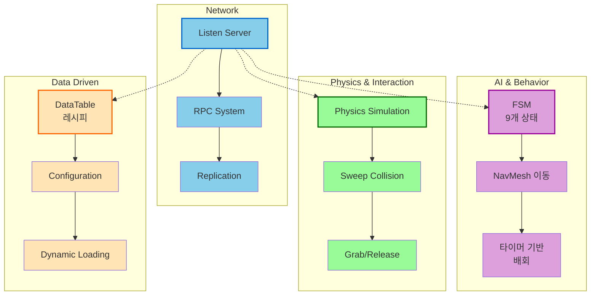

---

## 🎮 게임 플로우 및 시나리오

### 전체 게임 사이클

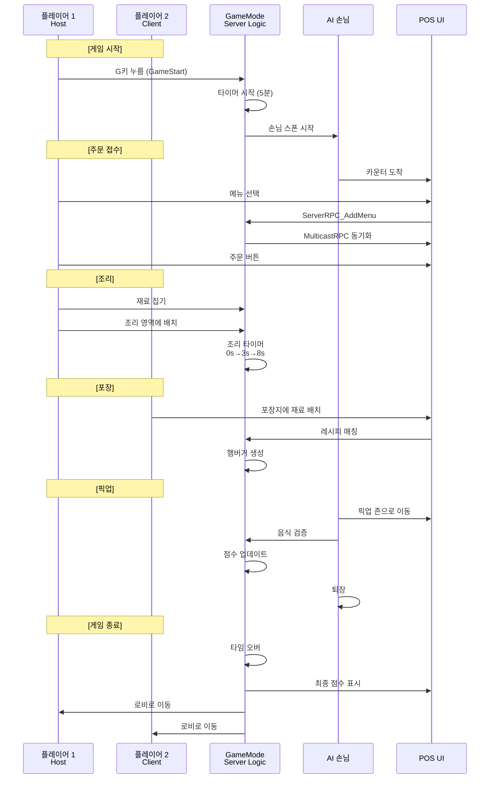

### 게임 상태 머신

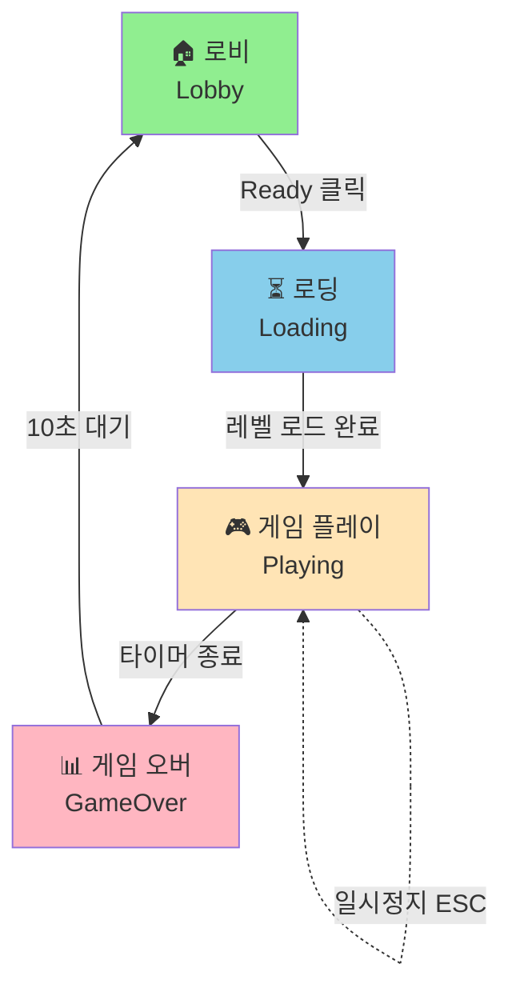

---

## 📊 성능 최적화

### 1. 네트워크 최적화
- **Authority 체크**: 서버에서만 실행되어야 하는 로직 분리
- **선택적 복제**: 필요한 데이터만 복제
- **RPC 최소화**: 여러 클라이언트 호출을 하나의 Multicast로 통합

### 2. AI 최적화
- **타이머 기반 업데이트**: Tick 대신 타이머로 배회 로직 처리
- **NavMesh 캐싱**: 이동 경로 재계산 최소화

### 3. 물리 최적화
- **Collision Profile 활용**: 상황에 맞는 충돌 설정
- **Physics Sleep**: 정지 시 물리 시뮬레이션 중지

---

## 🚀 향후 개선 방향

### 계획된 기능
- [x] **평판 시스템**: 손님 만족도에 따른 점수 관리 (ShowScoreFeedback 함수로 구현됨)
- [x] **난이도 조절**: 손님 스폰 빈도, 주문 복잡도 조절 (MaxSpawnedCustomers 변수 존재)
- [ ] **추가 메뉴**: 사이드 메뉴, 음료 시스템
- [ ] **시간 제한 모드**: 제한 시간 내 최대한 많은 주문 처리

---

## 📝 코드 구조

```
Source/MHGA/
├── Public/
│   ├── AI/
│   │   ├── CustomerAI.h          # 손님 캐릭터
│   │   ├── CustomerFSM.h         # 손님 FSM
│   │   ├── CustomerManager.h    # 손님 생성/관리
│   │   └── CustomerUI.h          # 손님 UI
│   ├── Counter/
│   │   ├── CounterPOS.h          # POS 시스템
│   │   ├── CounterUI.h           # POS UI
│   │   ├── MenuButtonUI.h        # 메뉴 버튼
│   │   ├── CustomerButtonUI.h   # 주문 버튼
│   │   ├── PickupZone.h          # 픽업 구역
│   │   └── ReceiptActor.h        # 영수증
│   ├── Ingredient/
│   │   ├── IngredientBase.h      # 재료 베이스 클래스
│   │   ├── Patty.h               # 패티 (조리 상태)
│   │   ├── SauceBottle.h         # 소스 병
│   │   └── [기타 재료들]
│   ├── Player/
│   │   ├── MHGACharacter.h       # 플레이어 캐릭터
│   │   ├── MHGAPlayerController.h# 플레이어 컨트롤러
│   │   ├── InteractComponent.h   # 상호작용 컴포넌트
│   │   └── PlayerAnim.h          # 애니메이션
│   ├── Props/
│   │   ├── Flipper.h             # 뒤집개
│   │   └── IngContainer.h        # 재료 컨테이너
│   ├── BurgerData.h              # 데이터 정의
│   ├── CookingArea.h             # 조리 영역
│   ├── GrabableProps.h           # 상호작용 인터페이스
│   ├── Hamburger.h               # 완성된 햄버거
│   ├── WrappingPaper.h           # 포장지
│   ├── MHGAGameMode.h            # 게임 모드
│   └── MHGAGameState.h           # 게임 스테이트
└── Private/
    └── [대응되는 .cpp 파일들]
```

---

## Members
- 김홍범
- 황규환
- 허지웅


---

## 📜 라이선스

Copyright Epic Games, Inc. All Rights Reserved.

---

### 주요 성과

| 영역 | 성과 | 기술 |
|------|------|------|
| **네트워크** | Listen Server 멀티플레이 구현 | RPC Chain, Replication |
| **AI** | 9가지 상태의 FSM 기반 손님 AI | NavMesh, State Management |
| **게임플레이** | 물리 기반 상호작용 시스템 | Physics Grab/Release, Collision |
| **UI/UX** | 3D 몰입형 POS 시스템 | Widget Component, Canvas |
| **데이터** | 확장 가능한 레시피 관리 | DataTable, JSON 설정 |
| **성능** | 최적화된 네트워크 설계 | Authority Check, Selective Replication |


**마지막 업데이트**: 2025년 11월 8일
